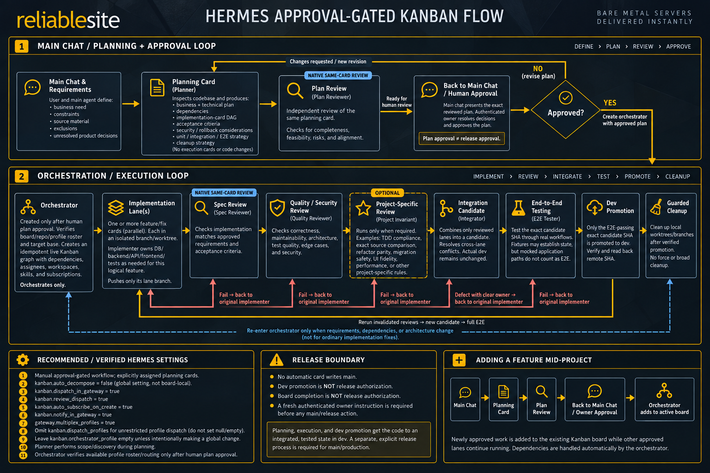

# Hermes Agent: approval-gated Kanban development

**Hermes Agent only.** This is not a generic Kanban board, an OpenClaw template, or an installable profile distribution. It documents a reusable setup for Hermes profiles, Kanban boards, native same-card reviews, forced skills, and a human-controlled release gate. The files in this folder are templates and a verified configuration snapshot; they do not modify a running Hermes installation.



[Open the full-size flow diagram](assets/hermes-approval-gated-kanban-flow.png). The diagram illustrates the workflow and observed settings; the steps and configuration snapshot below provide the detailed contract. In particular, plan approval and `dev` promotion do not authorize a `main` release.

## Components and authority

- A **board** isolates project cards, dependencies, evidence, and workspaces. A profile is a reusable role across boards; a project-specific skill supplies only that project's approved invariants. A chat subscription delivers status but does not approve work.
- **Planning:** main chat creates/reuses a neutral planner card; `planner` selects scope and attaches a versioned, hashed plan (or evidenced no-work finding). On the **same card**, `planner` calls `kanban_request_review(reviewer="plan-reviewer")`. The independent `plan-reviewer` either returns changes on that card or completes it with PASS. PASS means ready for human review, not authorization to implement.
- **Approval:** an authenticated owner approves the exact current artifact and resolves product decisions. Record approver, message/source, revision chain, attachment hashes, board, repository, target base, and any project-specific venue rule. An approval of a plan is not a release approval.
- **Delivery:** only after approval, `orchestrator` creates and verifies an idempotent card graph. For each lane: implementation + native same-card `spec-reviewer` handoff → separate quality/security review → prospective integration candidate → E2E of the **exact candidate SHA** → verified `dev` promotion → separate guarded local worktree cleanup. Remediation returns to the original implementor and invalidated gates rerun; neither failed E2E nor reviewer-requested changes advances `dev`.
- **Release:** never make automatic cards that write `main`. A fresh, verified owner instruction is required for a release; `dev` promotion, board completion, and planning approval are not that instruction.

## Planning and plan-review instructions

The planner and plan-reviewer profile instructions were updated on **October 4, 2026** to favor the simplest correct implementation and minimum sufficient testing. The [complete planning and review policy](skills/plan-review-gate/SKILL.md#simplicity-and-sufficient-testing) records those additions: reuse existing code and test infrastructure, avoid speculative machinery and excessive decomposition, and request changes only for material defects, missing required coverage, or clearly avoidable complexity—not architectural preference. A correct, sufficiently tested, proportionate plan receives PASS without added recommendations.

Generic templates do not justify extra granularity or duplicate coverage by themselves. Explicit owner decisions, project requirements, existing tests, security controls, and mandatory independent-review and real E2E gates remain binding. PASS still means ready for separate owner approval, never implementation or release authority.

To reproduce the profile-level instructions, compare the existing `SOUL.md` in each independent profile, then—only with authority to change that profile—add the corresponding planner or plan-reviewer policy plus the shared template-precedence rule. Preserve its other instructions and role boundaries; do not replace a full profile or assume updating the default skill updates either worker. The policy is also included in the public `plan-review-gate` skill for force-loaded planning cards. Publishing this folder does not edit live profiles, reload running workers, or retrofit existing cards.

## Files

- [`assets/hermes-approval-gated-kanban-flow.png`](assets/hermes-approval-gated-kanban-flow.png): visual overview of the planning, approval, execution, review, and release gates.
- [`profiles.json`](profiles.json): dated role/model/provider/reasoning, **explicit context/compression settings**, ordered fallback providers, delegation limits, and minimum reusable skills. It includes the default/main profile for comparison; installing a skill does not automatically force it onto every card.
- [`skill-routing.md`](skill-routing.md): explicit role-and-stage map of Hermes runtime guidance, native-review skill loading, reusable workflow skills, optional helper skills, and project-specific invariant skills.
- [`skills/approval-gated-kanban-development/SKILL.md`](skills/approval-gated-kanban-development/SKILL.md): concise generic delivery procedure.
- [`skills/plan-review-gate/SKILL.md`](skills/plan-review-gate/SKILL.md): reusable independent planning review procedure.
- [`templates/planner-card.md`](templates/planner-card.md) and [`templates/orchestrator-card.md`](templates/orchestrator-card.md): required card fields and approval boundary.
- [`examples/partner-network-api/README.md`](examples/partner-network-api/README.md): **sanitized** project wiring example. No project requirements, source plans, customer data, credentials, or live board export.
- [`scripts/validate.py`](scripts/validate.py): offline structural and public-content checks for this folder.

## Model context, compression, and fallback snapshot

`profiles.json` preserves the observed **explicit** primary model, reasoning effort, and compression/context keys for the default/main profile and all eight workers, plus each worker's ordered `fallback_providers`. Within these documented route/context fields, credentials and project-specific skill contents are the only redactions; this is a scoped workflow snapshot, **not** a full config or board dump or an importable backup. Keep absent keys absent rather than writing `null` or inferring inheritance between profiles. `global_settings_observed` records effective Kanban values; `global_settings_explicit` distinguishes the keys actually present in the default config. In particular, `kanban.dispatch_profiles` must be omitted, not set to `null`.

As observed on September 28, 2026, all nine profiles explicitly set `model.context_length` to **900,000** and `compression.threshold_tokens` to **372,000**. These are different things: the former is a configured primary-model window, and the latter is an absolute cap on the automatic compaction trigger. Seven workers and the default profile explicitly set `compression.threshold` to `0.65`; **`plan-reviewer` does not**—its installed default ratio is `0.50`, while its explicit 372,000-token cap still applies. The manifest retains the other explicit compression knobs too, rather than silently dropping them.

Every worker has one ordered provider/model fallback; the default/main profile has none. Fallback credentials must be provisioned separately. A fallback or per-card model/provider override changes the active route, so **do not assume the primary route's 900,000-token context pin carries over**: resolve and verify the fallback model's actual window and effective compression trigger. A card inherits its assignee profile's route unless it explicitly overrides model/provider/reasoning. None of these values grants a reviewer, worker, or fallback path permission to bypass approval or release gates.

## Worker delegation limits

The separately dated `delegation_snapshot` in `profiles.json` was resolved on **October 3, 2026** for the default profile and all eight workers. The September 28 model/context/fallback snapshot above remains a historical snapshot, not a claim that those routes were re-audited on October 3. `config_explicit` preserves actual key presence; `limits_effective` records the installed resolver's result, not values to blindly insert for omitted keys.

- **Implementor, specification reviewer, and quality/security reviewer:** `delegation.oneshot_max_children=10`, `delegation.max_concurrent_children=20`, and unchanged `delegation.max_spawn_depth=2`.
- **Default, planner, orchestrator, integrator, and E2E tester:** one-shot total **2** (key omitted), concurrent limit **10**, and depth **2**.
- **Plan reviewer:** all three keys are omitted; installed defaults resolve to **2** total, **10** concurrent, and depth **1**. A named profile does not inherit the default profile's depth.

These knobs govern different budgets. Kanban workers launch with `chat -q`, so the one-shot limit counts **cumulative direct children requested by each parent agent**; finishing a child does not restore that parent's budget. Interactive and gateway chat sessions are not charged by this one-shot guard. In the observed Hermes build, `max_concurrent_children` limits the number of tasks supplied in **each delegation call** and its batch parallelism; the same setting is also reused to admit background **call/batch slots across the process**. Multiple background calls can therefore have more active children in aggregate than this value: it is not a hard per-parent or whole-tree child ceiling. The separate one-shot budget still means a worker capped at 10 direct children cannot have 20 direct children at once. Permitted nested parents have their own cumulative counters and can increase aggregate descendant counts beyond 10. Spawn depth controls permitted delegation generations, subject to child role/tool permissions, rather than granting every child recursive delegation. Explicit `max_iterations` values are also retained in the snapshot, separately from these three limits.

These are **shared-profile** settings, not board-local overrides. The three-role increase affects every board using those profiles; the default and other roles were not increased. Higher concurrency can multiply API usage. Stored settings and fresh-process resolution were verified; this does **not** prove that an already-running worker adopted them or that an exhausted card resumed. Do not restart the gateway, reclaim cards, or reset spent-budget history as a side effect of copying this documentation.

Helper budgets are separate from card dispatch: `kanban.max_in_progress` is a global card-cap setting whose omitted/effective-null state can resolve differently by host; `kanban.max_in_progress_per_profile` is a per-profile card cap. `kanban.max_spawn` limits concurrent cards **per board**, including already-running workers and the shared ready/review lanes—not a fresh spawn allowance on each tick. `kanban.dispatch_interval_seconds` is polling cadence, not a child budget. None of these settings bypasses dependencies, independent reviews, exact-candidate validation, or human approval.

For an authorized setup matching the three increased roles, configure each profile explicitly (repeat for the other two names):

```text
hermes -p implementor config set delegation.oneshot_max_children 10
hermes -p implementor config set delegation.max_concurrent_children 20
```

Before changing an existing shared profile, identify its other boards and obtain the appropriate cross-board authority. Preserve omitted keys, back up exact target files privately, compare full YAML semantics for unrelated changes, and resolve all three limits under each target profile's home. Recheck the installed resolver and activation behavior after Hermes upgrades; a saved YAML value alone is not runtime evidence.

## Reproduce on a new Hermes installation

1. Check the installed CLI (`hermes --version`, `hermes kanban --help`, `hermes profile create --help`). Create *new* profiles for the eight role names in `profiles.json` with `hermes profile create <name> --description "<role capability>"`; do not replace an existing profile or clone a live `.env`, auth store, sessions, or memory. Set each new profile's `model_config_explicit`, `compression_config_explicit`, ordered `fallback_providers`, and `agent.reasoning_effort` from the manifest **without filling absent keys**. The default/main snapshot is included for comparison, not copied into workers. Probe each saved primary and fallback route, its canonical model, and its effective context/compaction threshold. Authentication is provisioned independently, outside Git. Keep the reviewer identities distinct from authors.
2. Install the two reusable workflow skills into the default profile and **each profile that uses them**, preserving `SKILL.md` paths. Check the profile's actual skills rather than assuming default-profile edits propagate. For dispatcher-owned tasks, Hermes injects `KANBAN_GUIDANCE` **only when that worker can access `kanban_show`**; verify Kanban tools are enabled for each worker profile. The native review dispatcher adds the shipped `sdlc-review` skill on review claims. Hermes removed the bundled `kanban-worker` and `kanban-orchestrator` skills; do **not** install or force-load retained copies. The [skill routing guide](skill-routing.md) distinguishes runtime guidance, native review, reusable workflow, and project skills. If an installed skill of the same name already exists, compare it before replacing anything. Changes to live profiles are a separate operational decision, not a side effect of cloning this folder.
3. Create a project board explicitly: `hermes kanban boards create <board-slug> --name "<name>" --default-workdir "<absolute-repo-path>"` (do **not** add `--switch`). Use `hermes kanban --board <board-slug> ...` or explicit `/kanban --board <board-slug> ...` on every operation. Use approved project context/sources and, when appropriate, an existing project-specific skill for product invariants; attach/force the skill on relevant cards. Do not create a new project skill when the owner excludes it. Keep a dedicated project context out of the generic template.
4. Check that the gateway dispatcher is actually running (`hermes gateway status`); start it only on a fresh installation with the operator's authorization. Confirm global settings before changing them: `kanban.dispatch_in_gateway=true`, `kanban.review_dispatch=true`, `kanban.auto_subscribe_on_create=true`, `kanban.notify_in_gateway=true`, `gateway.multiplex_profiles=true`. **Omit `kanban.dispatch_profiles` entirely** for unrestricted profile dispatch: an explicitly present `null`/empty value is fail-closed and claims no cards. `kanban.max_in_progress` is omitted here (effective `null`), which delegates concurrency to Hermes's host-dependent default rather than guaranteeing unlimited workers; set an explicit cap only when its cross-board effect is intended. Leave `kanban.orchestrator_profile` empty unless a global change is intended. `kanban.auto_decompose=false` was observed for the source installation but is **global**, not a project-only requirement. Do not change it solely to set up one board; bypass triage with explicitly assigned planning cards.
5. Run `python scripts/validate.py` from this folder. On a **separate throwaway board/repository**, verify a harmless planner → native plan-reviewer handoff, then a no-op implementation → native spec review → quality → candidate → E2E → promotion dependency graph **without any Git promotion or external writes**. Check assignees, effective model routes, workspaces, parent gates, source-chat notifications, and that no card can write `main`. Only then dispatch real work.

For a context-free planning trigger, explicitly create a card with `hermes kanban --board <slug> create "<title>" --assignee planner --workspace scratch --skill plan-review-gate --body-file <file>`; natural-language discussion by itself is not a deterministic card command. **CLI-created cards do not automatically inherit the originating chat's subscription.** Subscribe and read it back explicitly (replace placeholders, including the actual chat type and guild where applicable):

```text
hermes kanban --board <slug> notify-subscribe <task-id> --platform discord --chat-id <chat-id> --chat-type group --guild-id <guild-id> --notifier-profile <profile-serving-chat> --delivery-mode notify+wake
hermes kanban --board <slug> notify-list <task-id> --json
```

When creating from the originating gateway chat, verify the resulting subscription instead of assuming it. In the throwaway test, also verify a notification actually reaches that chat; a saved subscription row alone does not prove delivery. The `orchestrator` is created only after the exact reviewed plan has separate human approval.

For the new profiles, also consider the separately dated delegation snapshot above: copy only the approved explicit knobs for that role and verify effective limits rather than filling omissions with the default/main values. Maintain shared workflow skill copies using the [on-encounter repair procedure](skill-routing.md#maintain-shared-workflow-skills); cloning profiles once does not keep their skills synchronized.

## What is deliberately not exported

No live `kanban.db`, history, logs, workspaces, session transcripts, API keys, provider tokens, `.env`, full profile directories, project source documents, or customer data. A board export is a separate **sensitive data** operation, not an installation template. This repository folder does not change the Partner Network API board, its ongoing cards, or any profile. See the installed Hermes documentation and actual `--help` output for version-dependent commands.
